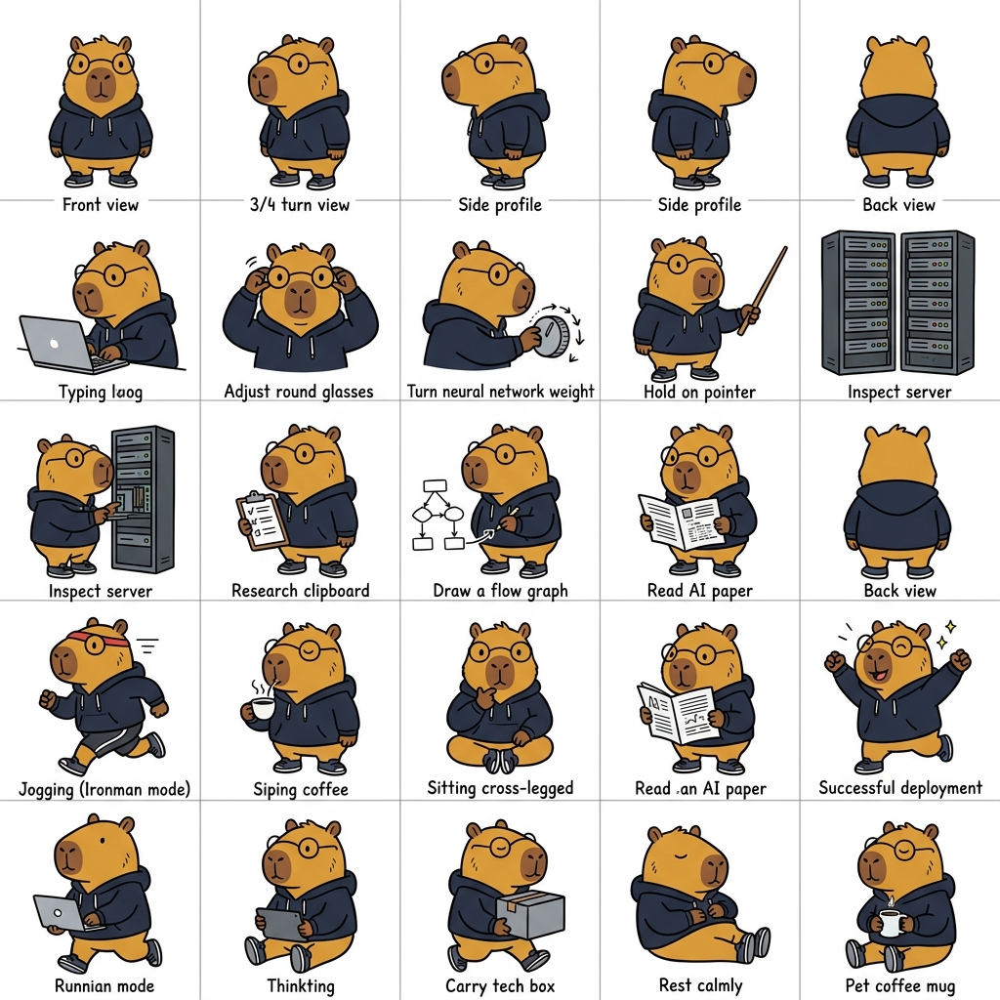

# Capynacci: Applied AI Illustration Framework 🦫⚡

**Capynacci** is an AI illustration skill framework designed to plan, generate, and edit 16:9 technical article illustrations starring **Capynacci** — an Applied AI Researcher & Tech Founder Capybara.



## About Capynacci IP

* **Species**: Capybara (*Hydrochoerus hydrochaeris*)
* **Color**: Warm golden-brown fur with a cute brown snout
* **Outfit**: Signature dark navy tech hoodie, smart round spectacles, and athletic running shoes
* **Persona**: Applied AI Researcher, Founder & R&D Director at Braincore Research Labs, and endurance athlete
* **Vibe**: Unbothered, calm, *deadpan-wise*, smart, and entrepreneurial

## Visual Style

* **Kanvas**: Pure white background (`#FFFFFF`) with generous white space (40%+ blank)
* **Diagram Line Art**: Minimalist black hand-drawn doodle lines
* **Contrast**: Capynacci is rendered in full warm color to pop out iconically against the minimalist black-and-white background diagram
* **Annotations**: 3-5 sparse handwritten English labels (Black for main text, Orange for data flow, Red for loss/warnings, Blue for weights & system state)

## Repository Structure

```text
capynacci/
├── SKILL.md                          # Main AI Agent Skill Definition
├── README.md                         # Project documentation
├── .gitignore                        # Git ignore rules
├── references/
│   ├── capynacci-ip.md              # Character identity & action rules
│   ├── style-dna.md                 # Visual DNA & color usage
│   ├── prompt-template.md           # Generation & editing prompts
│   ├── composition-patterns.md      # Metaphor structures & rules
│   └── qa-checklist.md              # Quality control checklist
└── assets/
    └── capynacci-illustrations/     # Sample & generated assets
```

## License

MIT © [Eric Julianto (Algonacci)](https://github.com/algonacci)
